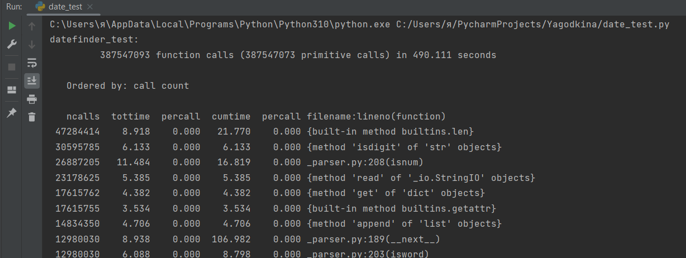
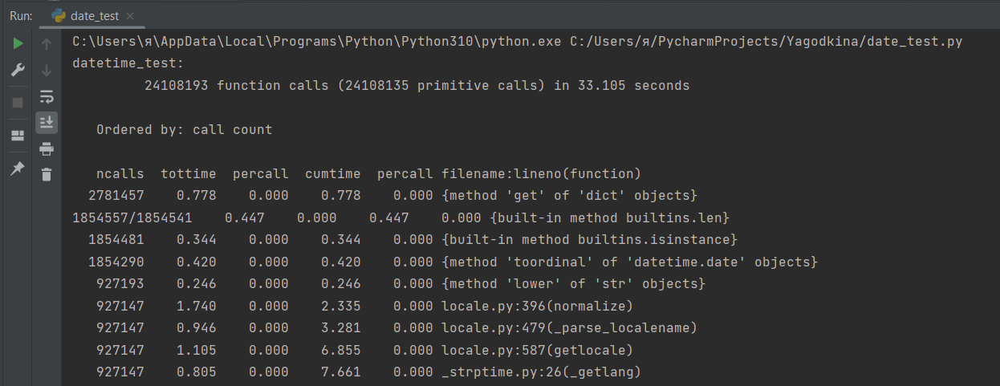
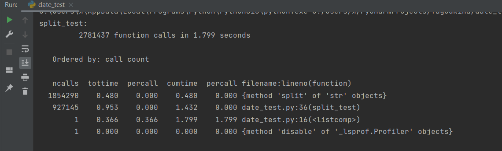
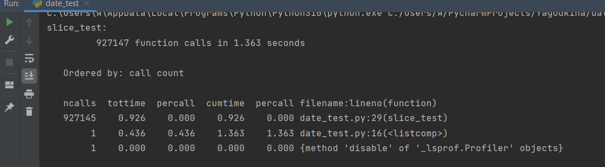
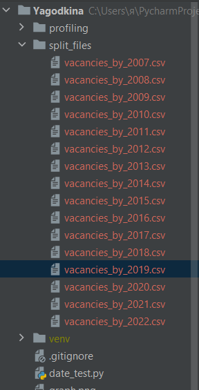
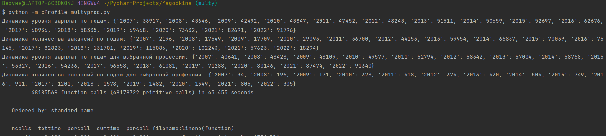
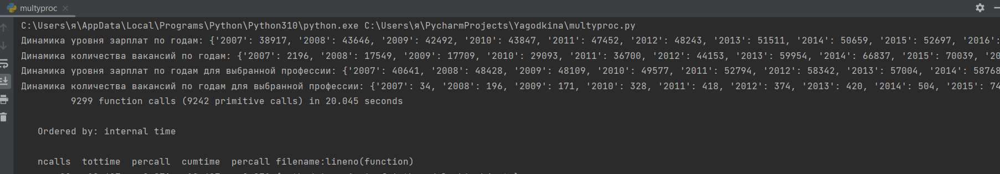
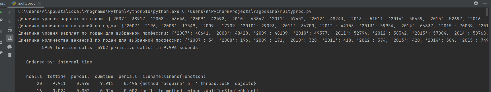

# Результат doctest

# Результат unittest

# Профилирование

Вывод: самый оптимальный вариант - slice_test

# Разделенные по годам вакансии

# Многопроцессорная обработка
1) без нее

2) с 16 процессами

3) с 4 процессами
